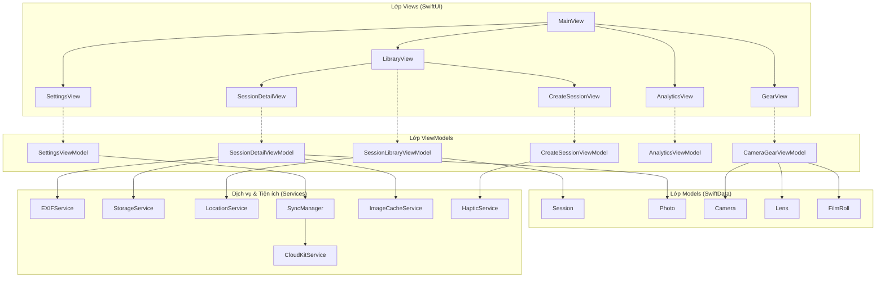

# 📸 Memento Frames


> **Mỗi khung hình là một câu chuyện.**  
> Memento Frames là ứng dụng nhật ký nhiếp ảnh cao cấp dành cho iOS. Ứng dụng được thiết kế cho những người đam mê nhiếp ảnh—dù sử dụng máy phim analog, DSLR, mirrorless hay điện thoại thông minh—để ghi chép lại các buổi chụp (sessions), tổ chức thiết bị (gear), lưu giữ siêu dữ liệu ảnh (EXIF) và khám phá những kỷ niệm thông qua bản đồ tương tác.

---

## 📌 Mục lục

- [✨ Tính năng Nổi bật](#-tính năng-nổi-bật)
- [🛠 Công nghệ Sử dụng](#-công-nghệ-sử-dụng)
- [🏗 Kiến trúc & Các Mẫu Thiết kế](#-kiến-trúc--các-mẫu-thiết-kế)
- [📂 Cấu trúc Thư mục](#-cấu-trúc-thư-mục)
- [📊 Mô hình Dữ liệu (Data Models)](#-mô-hình-dữ-liệu-data-models)
- [⚙️ Dịch vụ Cốt lõi](#️-dịch-vụ-cốt-lõi)
- [🎨 Hệ thống Thiết kế UI/UX](#-hệ-thống-thiết-kế-uiux)
- [🚀 Hướng dẫn Cài đặt & Thiết lập](#-hướng-dẫn-cài-đặt--thiết-lập)
- [📋 Danh sách Quyền Yêu cầu](#-danh-sách-quyền-yêu-cầu)
- [🤝 Đóng góp](#-đóng-góp)
- [📄 Giấy phép](#-giấy-phép)

---

## ✨ Tính năng Nổi bật

### 📖 Nhật ký & Quản lý Buổi chụp
* **Ghi chép chi tiết**: Tạo và tổ chức các buổi chụp với tiêu đề, địa điểm, ngày tháng và nội dung nhật ký chi tiết hỗ trợ Markdown.
* **Thư viện ảnh mượt mà**: Xem lưới ảnh độ phân giải cao sử dụng cơ chế tải lười (lazy loading) tối ưu bộ nhớ.
* **Tự động trích xuất siêu dữ liệu**: Phân tích và hiển thị thông tin máy ảnh, khẩu độ, tốc độ màn trập, ISO, tiêu cự và thời gian chụp từ ảnh đã import.

### 🎒 Quản lý Thiết bị (Gear)
* **Danh mục Máy ảnh**: Theo dõi thân máy, thương hiệu, mẫu máy, năm mua và ghi chú đi kèm.
* **Danh mục Ống kính**: Lưu trữ tiêu cự, khẩu độ tối đa và loại ngàm (ví dụ: EF, RF, E-Mount, Leica M).
* **Liên kết Buổi chụp**: Dễ dàng gán máy ảnh và ống kính tương ứng cho mỗi buổi chụp cụ thể.

### 🗺 Bản đồ Tương tác & Định vị
* **Bản đồ Buổi chụp**: Theo dõi chính xác vị trí của từng bức ảnh được chụp bằng các chốt định vị GPS trên bản đồ MapKit.
* **Bản đồ Toàn cầu**: Hiển thị bản đồ tổng hợp tất cả ảnh đã chụp trên toàn bộ nhật ký.
* **Tự động điều chỉnh vùng**: Bản đồ tự động thu phóng để hiển thị đầy đủ tất cả các ảnh có gắn tọa độ trong buổi chụp.

### 📊 Phân tích & Biểu đồ trực quan
* **Thống kê Thiết bị**: Biểu đồ trực quan hóa những thân máy và ống kính được sử dụng thường xuyên nhất.
* **Xu hướng Nhiếp ảnh**: Xem số lượng ảnh đã chụp theo từng tháng và các địa điểm nổi bật thông qua thư viện Swift Charts.
* **Tỷ lệ Phim/Số**: Theo dõi tỷ lệ giữa số lượng ảnh chụp phim analog và ảnh kỹ thuật số.

### 🎞 Chế độ Máy phim (Tùy chọn)
* **Theo dõi trạng thái cuộn phim**: Quản lý vòng đời cuộn phim từ lúc `Đang chụp (Shooting)` ➔ `Đã chụp xong (Finished)` ➔ `Đã tráng (Developed)` ➔ `Đã scan (Scanned)`.
* **Gán cuộn phim**: Liên kết các cuộn phim vào từng buổi chụp để quản lý và theo dõi tiến độ.

### ☁️ Đồng bộ iCloud & Hoạt động Ngoại tuyến
* **Đồng bộ hóa CloudKit**: Tự động đồng bộ hóa cơ sở dữ liệu lên tài khoản iCloud cá nhân của người dùng.
* **Giải quyết xung đột**: Áp dụng quy tắc "Ghi đè mới nhất" (Latest Write Wins) để đồng bộ dữ liệu giữa nhiều thiết bị một cách an toàn.
* **Hỗ trợ Ngoại tuyến**: Lưu trữ dữ liệu an toàn dưới local và tự động cập nhật lên đám mây ngay khi có kết nối mạng.

---

## 🛠 Công nghệ Sử dụng

| Thành phần | Công nghệ | Mục đích |
| :--- | :--- | :--- |
| **UI Framework** | SwiftUI | Xây dựng giao diện khai báo hiện đại với hiệu ứng chuyển động mượt mà |
| **Database** | SwiftData | Công cụ lưu trữ dữ liệu local type-safe, thay thế toàn bộ CoreData |
| **Cloud Sync** | CloudKit | Lưu trữ và đồng bộ hóa đám mây an toàn qua container iCloud cá nhân |
| **Biểu đồ** | Swift Charts | Trực quan hóa dữ liệu thống kê thiết bị và xu hướng chụp ảnh |
| **Import Ảnh** | PhotosUI | Bộ chọn ảnh hệ thống hỗ trợ chọn nhiều ảnh đồng thời |
| **Metadata** | ImageIO | Framework mức thấp của Apple hỗ trợ phân tích siêu dữ liệu EXIF/GPS |
| **Bản đồ** | MapKit | Tích hợp bản đồ tương tác, ghim vị trí và cấu hình khu vực |
| **Bất đồng bộ** | Swift Concurrency | Đảm bảo hiệu năng và an toàn luồng với Async/await và Actors |
| **Haptic UI** | CoreHaptics / Taptic | Tích hợp phản hồi xúc giác tinh tế cho các tương tác vật lý trong ứng dụng |

---

## 🏗 Kiến trúc & Các Mẫu Thiết kế

Memento Frames tuân thủ kiến trúc **MVVM (Model-View-ViewModel)** giúp phân chia rõ ràng trách nhiệm giữa dữ liệu biểu diễn, giao diện hiển thị và logic xử lý nghiệp vụ.

### Luồng Kiến trúc Hệ thống



### Các nguyên tắc thiết kế chính

* **Dependency Injection & Environment**: `ModelContext` của SwiftData được truyền từ `App` vào các View thông qua SwiftUI environment, cho phép sử dụng `@Query` trực tiếp để tải dữ liệu thời gian thực với hiệu năng tối đa.
* **Actor Thread Safety**: Các tác vụ xử lý IO nặng (như ghi ảnh lên đĩa, phân tích EXIF) được đẩy hoàn toàn ra khỏi luồng giao diện chính (Main Thread) thông qua các actor riêng biệt (`StorageService`, `EXIFService`).
* **Haptic UI Feedback**: Tích hợp các phản hồi xúc giác nhẹ thông qua `HapticService` khi thực hiện các hành động quan trọng (như lưu buổi chụp, xóa thiết bị, thông báo lỗi).

---

## 📂 Cấu trúc Thư mục

```
memento_frames/
├── Assets.xcassets/           # Hình ảnh, màu sắc chủ đề và logo ứng dụng
├── Components/                # Các thành phần giao diện tái sử dụng (SwiftUI Components)
│   ├── ChartsView.swift       # Biểu đồ thống kê và trực quan dữ liệu
│   ├── EmptyStateView.swift   # Giao diện trống khi không có dữ liệu
│   ├── FloatingActionButton.swift # Nút hành động nổi cao cấp (FAB)
│   ├── FormComponents.swift   # Các trường nhập liệu mẫu tiêu chuẩn
│   ├── GearCardView.swift     # Thẻ hiển thị thiết bị máy ảnh và ống kính
│   ├── GlassCardView.swift    # Thẻ thiết kế hiệu ứng kính mờ (Glassmorphism)
│   ├── HeroImageView.swift    # Banner ảnh nổi bật phía đầu trang với hiệu ứng mờ
│   ├── LoadingView.swift      # Vòng xoay tải dữ liệu đồng bộ
│   ├── MetadataChip.swift     # Nhãn tag nhỏ hiển thị trạng thái và thông số
│   ├── MetadataView.swift     # Bảng thông số chi tiết EXIF
│   ├── PhotoGridView.swift    # Lưới hiển thị ảnh tối ưu hiệu năng
│   ├── PhotoThumbnailView.swift # Xem trước hình thu nhỏ ảnh đơn lẻ
│   ├── SessionCardView.swift  # Thẻ xem trước buổi chụp ngoài thư viện
│   └── StatisticsCardView.swift # Thẻ thống kê chỉ số phân tích
├── Models/                    # Thực thể cơ sở dữ liệu (SwiftData Entities)
│   ├── Session.swift          # Thông tin buổi chụp (Tiêu đề, ngày, địa điểm)
│   ├── Photo.swift            # Thông tin ảnh chụp (Đường dẫn ảnh local, GPS, EXIF)
│   ├── Camera.swift           # Thông tin máy ảnh
│   ├── Lens.swift             # Thông tin ống kính
│   └── FilmRoll.swift         # Thông tin cuộn phim và trạng thái tráng/quét
├── Services/                  # Dịch vụ hỗ trợ Logic & Hệ thống phần cứng
│   ├── EXIFService.swift      # Trích xuất EXIF bất đồng bộ thông qua ImageIO
│   ├── StorageService.swift   # Quản lý đọc/ghi tệp tin local an toàn luồng (actor)
│   ├── LocationService.swift  # Quản lý định vị GPS thông qua CoreLocation
│   ├── CloudKitService.swift  # Kết nối cơ sở dữ liệu iCloud Private
│   ├── ImageCacheService.swift # Bộ nhớ đệm tạm lưu trữ ảnh để tải mượt mà
│   └── SyncManager.swift      # Điều phối đồng bộ hóa SwiftData và CloudKit
├── ViewModels/                # Lớp logic xử lý dữ liệu cho View
│   ├── SessionLibraryViewModel.swift
│   ├── CreateSessionViewModel.swift
│   ├── SessionDetailViewModel.swift
│   ├── CameraGearViewModel.swift
│   ├── AnalyticsViewModel.swift
│   └── SettingsViewModel.swift
├── Views/                     # Các màn hình giao diện chính (SwiftUI Screens)
│   ├── MainView.swift         # Màn hình định tuyến chính chứa Tab Bar
│   ├── LibraryView.swift      # Danh sách buổi chụp, tìm kiếm và bộ lọc
│   ├── CreateSessionView.swift # Biểu mẫu tạo buổi chụp mới có xác thực dữ liệu
│   ├── EditSessionView.swift   # Biểu mẫu chỉnh sửa thông tin buổi chụp
│   ├── SessionDetailView.swift # Chi tiết buổi chụp cùng bộ sưu tập ảnh
│   ├── PhotoMapView.swift     # Bản đồ định vị các ảnh trong buổi chụp cụ thể
│   ├── GlobalMapView.swift    # Bản đồ toàn cầu hiển thị toàn bộ ảnh trong máy
│   ├── GearView.swift         # Quản lý kho máy ảnh, ống kính và cuộn phim
│   ├── AnalyticsView.swift    # Trang phân tích thông số và biểu đồ sử dụng
│   └── SettingsView.swift     # Cài đặt giao diện tối, iCloud và tùy chọn nhà phát triển
├── Utilities/                 # Tiện ích bổ trợ và mở rộng (Extensions & Utilities)
│   ├── Color+Theme.swift      # Bảng màu thiết kế journal cao cấp & các modifier
│   ├── HapticService.swift    # Bộ điều khiển phản hồi xúc giác phần cứng
│   ├── MockData.swift         # Công cụ tạo dữ liệu giả lập cho Xcode Canvas
│   └── ModelContext+Preview.swift # Khởi tạo SwiftData bộ nhớ tạm cho Canvas
└── memento_framesApp.swift    # Điểm chạy ứng dụng chính (App Entry Point)
```

---

## 📊 Mô hình Dữ liệu (Data Models)

### 📝 Mô hình Session (Buổi chụp)
Chứa thông tin tổng quan của một buổi đi chụp ảnh thực tế.

```swift
@Model final class Session: Identifiable {
    @Attribute(.unique) var id: UUID
    var title: String                          // Tiêu đề bắt buộc
    var date: Date                             // Ngày diễn ra buổi chụp
    var location: String                       // Địa điểm đi chụp (tùy chọn)
    var note: String                           // Ghi chú chi tiết hỗ trợ Markdown
    var coverPhotoPath: String?                // Đường dẫn tương đối của ảnh bìa
    var createdAt: Date                        // Thời gian tạo bản ghi
    
    @Relationship(deleteRule: .cascade)
    var photos: [Photo]                        // Mối quan hệ chứa nhiều Ảnh (tự động xóa kèm)
    
    var camera: Camera?                        // Máy ảnh sử dụng
    var lens: Lens?                            // Ống kính sử dụng
    var filmRoll: FilmRoll?                    // Cuộn phim gắn kèm (nếu chụp máy phim)
}
```

### 🖼 Mô hình Photo (Ảnh chụp)
Lưu trữ tham chiếu ảnh lưu trữ cục bộ cùng siêu dữ liệu máy ảnh và tọa độ địa lý.

```swift
@Model final class Photo: Identifiable {
    @Attribute(.unique) var id: UUID
    var imagePath: String                      // Đường dẫn tương đối lưu trong thư mục Sandbox của App
    var note: String                           // Ghi chú riêng cho bức ảnh
    var latitude: Double?                      // Vĩ độ GPS
    var longitude: Double?                     // Kinh độ GPS
    var iso: Int?                              // Chỉ số ISO của ảnh
    var aperture: String?                      // Khẩu độ (Ví dụ: "f/1.8", "f/5.6")
    var shutterSpeed: String?                  // Tốc độ màn trập (Ví dụ: "1/250", "30s")
    var focalLength: String?                   // Tiêu cự ống kính (Ví dụ: "50mm")
    var captureDate: Date?                     // Ngày giờ chụp ảnh thực tế từ EXIF
    var createdAt: Date                        // Thời gian import ảnh vào app
}
```

### 🎒 Mô hình Gear & Film (Thiết bị & Phim)
Định nghĩa cấu trúc lưu trữ thông tin thiết bị cơ học.

```swift
@Model final class Camera: Identifiable {
    @Attribute(.unique) var id: UUID
    var brand: String                          // Hãng máy ảnh (Ví dụ: Leica, Canon)
    var model: String                          // Dòng máy (Ví dụ: M10, EOS R5)
    var purchaseYear: Int?                     // Năm mua thiết bị
    var notes: String                          // Ghi chú cá nhân
    var createdAt: Date
}

@Model final class Lens: Identifiable {
    @Attribute(.unique) var id: UUID
    var focalLength: String                    // Tiêu cự (Ví dụ: "50")
    var mount: String                          // Loại ngàm (Ví dụ: "L-mount", "M-mount")
    var aperture: String                       // Khẩu độ lớn nhất (Ví dụ: "1.4")
    var notes: String
    var createdAt: Date
}

@Model final class FilmRoll: Identifiable {
    @Attribute(.unique) var id: UUID
    var filmName: String                       // Tên loại phim (Ví dụ: Gold 200, Portra 400)
    var isoSpeed: Int                          // Độ nhạy sáng của phim (ISO)
    var brand: String                          // Hãng sản xuất phim (Ví dụ: Kodak, Fujifilm)
    var notes: String
    var status: FilmRollStatus                 // Trạng thái cuộn phim
    var createdAt: Date
}

enum FilmRollStatus: String, Codable {
    case shooting = "Shooting"                 // Đang chụp
    case finished = "Finished"                 // Đã chụp hết
    case developed = "Developed"               // Đã tráng xong
    case scanned = "Scanned"                   // Đã quét ảnh
}
```

---

## ⚙️ Dịch vụ Cốt lõi

### 📸 EXIFService
Một `actor` độc lập chịu trách nhiệm trích xuất siêu dữ liệu ảnh:
* Đọc tiêu đề ảnh thông qua `CGImageSource` để giải nén từ điển EXIF mà không cần tải toàn bộ bitmap lên bộ nhớ RAM.
* Phân tích các trường thông số ISO, khẩu độ, tốc độ màn trập, tiêu cự và thời gian chụp bất đồng bộ.
* Định dạng lại thời gian phơi sáng thực tế từ số thập phân sang phân số dễ hiểu hơn (Ví dụ: `0.002` giây ➔ `1/500`).

### 💾 StorageService
Dịch vụ xử lý tệp tin cục bộ an toàn luồng:
* Lưu trữ hình ảnh được chọn từ thư viện vào thư mục Document Sandbox của ứng dụng.
* Đặt tên tệp chuẩn hóa theo ID độc bản của mô hình Photo nhằm tránh xung đột đè tệp.
* Hỗ trợ dọn dẹp các tệp ảnh trên đĩa cứng tương ứng khi các thực thể Photo hoặc Session bị xóa khỏi SwiftData.

### 🛰 LocationService
Dịch vụ chạy trên Main Actor giám sát tọa độ địa lý:
* Yêu cầu và xử lý trạng thái cấp quyền định vị của hệ thống iOS.
* Định vị nhanh vị trí hiện tại để gán thông số GPS khi chụp ảnh trực tiếp trong ứng dụng.

### 🔄 SyncManager & CloudKitService
Cơ chế đồng bộ hóa dữ liệu đám mây:
* Đối chiếu trạng thái lưu trữ của cơ sở dữ liệu local (SwiftData) với dữ liệu trên iCloud cá nhân của người dùng.
* Thực hiện đồng bộ hóa ngầm tự động và xử lý ghép các thay đổi trùng lặp.
* Cập nhật các trạng thái đồng bộ hóa trực tiếp lên giao diện của người dùng (`Đang đồng bộ`, `Đã đồng bộ`, `Lỗi kết nối`).

---

## 🎨 Hệ thống Thiết kế UI/UX

Memento Frames mang lại trải nghiệm giao diện cao cấp mang phong cách journal cổ điển kết hợp hiệu ứng kính mờ (glassmorphism) tinh tế.

### Bảng màu Chủ đề (`Color+Theme.swift`)
* 🎨 **Màu Vàng Đồng/Cát Ấm** (`Color.photoAccent`): Gợi nhớ đến các núm vặn bằng đồng trên máy ảnh cơ cổ điển và giấy in ảnh màu vàng ấm.
* 🔴 **Màu Đỏ Leica** (`Color.photoRed`): Dành cho các thông báo khẩn cấp, nút bấm ghi/quay hoặc các điểm nhấn chính.
* 🍦 **Màu Kem Nhạt** (`Color.photoBackgroundLight`): Màu nền phong cách tạp chí cổ điển khi ở chế độ sáng (Light Mode).
* 🌑 **Màu Đen Matte** (`Color.photoBackgroundDark`): Màu nền mô phỏng buồng tối rửa ảnh chuyên nghiệp khi bật chế độ tối (Dark Mode).

### Hiệu ứng & Chuyển động
* **Premium Spring Curves**: Các tấm sheet giao diện bật lên hoặc tab chuyển đổi áp dụng gia tốc lò xo tự nhiên (`.premiumSpring`).
* **Visual Shimmer Overlay**: Sử dụng hiệu ứng lóe sáng (shimmer modifier) mượt mà cho các thành phần đang chờ tải dữ liệu.

---

## 🚀 Hướng dẫn Cài đặt & Thiết lập

### Yêu cầu cấu hình
* **Hệ điều hành**: macOS Sonoma 14.0 trở lên
* **Xcode**: Phiên bản 15.0 trở lên
* **Swift**: Phiên bản 6.0 trở lên
* **iOS SDK**: Phiên bản iOS 17.0 trở lên

### Các bước cài đặt nhanh

1. **Tải mã nguồn (Clone)**
   ```bash
   git clone https://github.com/yourusername/memento_frames.git
   cd memento_frames
   ```

2. **Mở dự án trên Xcode**
   ```bash
   open memento_frames.xcodeproj
   ```

3. **Cài đặt ký số ứng dụng (Signing)**
   * Chọn tệp cấu hình root `memento_frames` ở cây thư mục bên trái của Xcode.
   * Truy cập tab **Signing & Capabilities**.
   * Ở phần **Team**, chọn tài khoản Apple Developer của bạn để Xcode tạo provisioning profile tự động.

4. **Thiết lập iCloud Sync (Tùy chọn)**
   * Trong tab **Signing & Capabilities**, nhấn vào nút **+ Capability** và thêm **iCloud**.
   * Đánh dấu chọn **CloudKit** ở mục iCloud Services.
   * Nhấn nút thêm container mới và đặt tên định danh có định dạng `iCloud.com.yourcompany.memento-frames`.
   * Tiếp tục chọn thêm capability **Background Modes** và tích chọn mục **Remote notifications** để nhận thông báo đồng bộ ngầm.

5. **Chạy ứng dụng**
   * Chọn máy ảo mô phỏng (iOS 17+) hoặc thiết bị thật đã cắm cáp.
   * Nhấn phím tắt `Cmd + R` hoặc bấm nút **Run** trên thanh công cụ Xcode để build ứng dụng.

---

## 📋 Danh sách Quyền Yêu cầu

Ứng dụng cần yêu cầu các quyền truy cập hệ thống phần cứng. Vui lòng kiểm tra và khai báo các khóa sau trong tệp `Info.plist` của bạn:

| Tên khóa (Plist Key) | Loại quyền | Nội dung thông báo hiển thị cho người dùng |
| :--- | :--- | :--- |
| `NSPhotoLibraryUsageDescription` | Truy cập Thư viện ảnh | *"Memento Frames cần quyền truy cập vào thư viện ảnh để nhập ảnh cho các buổi chụp hình của bạn."* |
| `NSLocationWhenInUseUsageDescription` | Truy cập Định vị GPS | *"Memento Frames sử dụng vị trí của bạn để gắn thẻ ảnh với dữ liệu GPS."* |
| `NSCameraUsageDescription` | Truy cập Máy ảnh | *"Memento Frames cần quyền máy ảnh để bạn có thể chụp ảnh trực tiếp trong buổi chụp."* |

---

## 🤝 Đóng góp

Mọi ý kiến đóng góp cải tiến dự án Memento Frames luôn được chào đón!

1. Fork dự án này.
2. Tạo nhánh tính năng mới (`git checkout -b feature/AmazingFeature`).
3. Commit các thay đổi (`git commit -m 'Add AmazingFeature'`).
4. Push nhánh của bạn lên Remote (`git push origin feature/AmazingFeature`).
5. Tạo một yêu cầu gộp mã nguồn (**Pull Request**).

### Quy tắc phát triển mã nguồn (Swift Code Guidelines)
* Tránh sử dụng toán tử unwrap cưỡng bức (`!`). Hãy sử dụng `if let` hoặc `guard let` để xử lý an toàn giá trị optional.
* Đảm bảo mã nguồn biên dịch hoàn tất, không phát sinh lỗi cảnh báo trong Strict Concurrency của Swift 6.
* Thêm dữ liệu giả lập tương ứng vào `MockData.swift` cho các mô hình dữ liệu mới được thêm vào.
* Luôn khai báo cấu trúc `#Preview` tương thích Canvas để hỗ trợ thiết kế giao diện trực quan.

---

## 📄 Giấy phép

Phát hành theo giấy phép **MIT License**. Vui lòng xem tệp `LICENSE` để biết thêm chi tiết.

---

**Memento Frames — Mỗi khung hình là một câu chuyện.** 📸  
*Được phát triển đầy đam mê bằng ngôn ngữ Swift, SwiftUI và SwiftData.*
